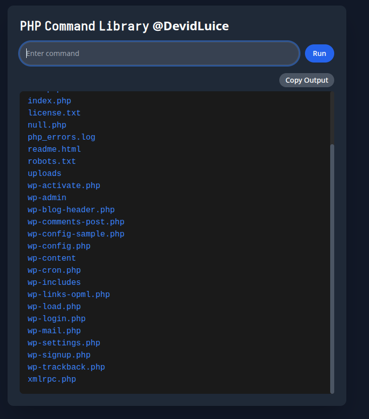

# PHP Commando Web App



A powerful, terminal-like command-line interface (CLI) built with PHP, designed to run Linux-like commands in a web browser. Created by KHAYROL ISLAM (@DevidLuice), this app offers a sleek, dark-themed UI with over 60 commands, piping support, JSON output formatting, and a responsive design. Perfect for developers, hobbyists, or anyone wanting to experiment with CLI commands in a safe, web-based environment.

## Features

- **60+ Commands**: Execute commands like `ls`, `cat`, `grep`, `curl`, `wget`, `whoami`, `mkdir`, `rm`, and more.
- **Piping Support**: Chain commands, e.g., `cat Uploads/passwd | grep "root"` or `curl <url> | grep "pattern"`.
- **JSON Output Handling**: Pretty-prints and highlights JSON responses (e.g., from `curl` or `cat` on JSON files) using Prism.js.
- **Copy Output**: One-click button to copy command output to the clipboard.
- **Responsive Terminal**: Larger output area (600px or 80vh) with a custom scrollbar and dark theme powered by Tailwind CSS.
- **Command History**: Navigate previous commands using up/down arrow keys, stored in `localStorage`.
- **Secure File Access**: Operations restricted to an `Uploads/` directory, blocking sensitive paths like `/etc/`.
- **Cross-Platform**: Runs on any web server with PHP (e.g., Apache, Nginx).

## Screenshots

*Add screenshots to the `screenshots/` folder and update the paths below.*

- Main Interface: `screenshots/commando.png`
- JSON Output: `screenshots/json-output.png`
- Piping Example: `screenshots/piping.png`

## Installation

### Prerequisites
- Web server (e.g., Apache, Nginx)
- PHP 7.4+ with extensions: `php-curl`, `php-posix`
- Write permissions for the `Uploads/` directory

### Setup
1. **Clone the Repository**
   ```bash
   git clone https://github.com/mrTr1cky/php-commando-web-app.git
   cd php-commando-web-app
   ```

2. **Configure the Web Server**
   - Copy `commando.php` to your web server's document root (e.g., `/var/www/html`).
   - Ensure PHP is installed:
     - Ubuntu/Debian:
       ```bash
       sudo apt-get update
       sudo apt-get install php php-curl php-posix
       ```
     - CentOS/RHEL:
       ```bash
       sudo yum install php php-curl php-posix
       ```

3. **Set Up the Uploads Directory**
   - Create the `Uploads/` directory:
     ```bash
     mkdir -p /var/www/html/Uploads
     ```
   - Set permissions (e.g., for Apache's `www-data` user):
     ```bash
     chmod -R 775 /var/www/html/Uploads
     chown -R www-data:www-data /var/www/html/Uploads
     ```

4. **Access the App**
   - Open your browser and navigate to `http://your-server/commando.php`.
   - For production, use HTTPS to secure data transmission.

## Usage

1. **Access the Interface**
   - Visit `http://your-server/commando.php`.
   - Enter commands in the input field and click "Run" or press Enter.

2. **Example Commands**
   - **List Files**:
     ```bash
     ls
     ```
     *Output*: Lists files in `Uploads/` (e.g., `passwd test.json`).

   - **Piping Example**:
     - Create `Uploads/passwd` with:
       ```
       root:x:0:0:root:/root:/bin/bash
       user:x:1000:1000:user:/home/user:/bin/bash
       ```
     - Command:
       ```bash
       cat passwd | grep "root"
       ```
     - *Output*:
       ```
       root:x:0:0:root:/root:/bin/bash
       ```

   - **JSON Handling**:
     - Create `Uploads/test.json` with:
       ```json
       {"name":"John","age":30,"city":"Dhaka"}
       ```
     - Command:
       ```bash
       cat test.json
       ```
     - *Output* (pretty-printed with syntax highlighting):
       ```json
       {
           "name": "John",
           "age": 30,
           "city": "Dhaka"
       }
       ```

     - Or fetch JSON from an API:
       ```bash
       curl https://api.github.com/users/octocat
       ```
       *Output*: Pretty-printed GitHub user data.

   - **Copy Output**:
     - Run any command (e.g., `ls` or `cat test.json`).
     - Click the "Copy Output" button.
     - Paste the output into a text editor.

   - **Command History**:
     - Use up/down arrow keys to navigate previous commands.

3. **View All Commands**:
   ```bash
   help
   ```
   *Output*: Lists all 60+ commands with descriptions.

## Security Notes
- **File Access**: All file operations are restricted to the `Uploads/` directory. Paths like `/etc/passwd` are explicitly blocked.
- **Input Sanitization**: User inputs are sanitized to prevent injection attacks.
- **Output Escaping**: Outputs are escaped to prevent XSS.
- **Production Recommendations**:
  - Serve over HTTPS.
  - Implement rate limiting to prevent abuse.
  - Replace the `bc` command's `eval` with a safe math parser for production.

## Contributing
Contributions are welcome! To contribute:
1. Fork the repository: `https://github.com/mrTr1cky/php-commando-web-app`.
2. Create a feature branch: `git checkout -b feature/your-feature`.
3. Commit changes: `git commit -m "Add your feature"`.
4. Push to the branch: `git push origin feature/your-feature`.
5. Open a pull request.

Please include tests and follow the coding style in `commando.php`. For issues or feature requests, open an issue on GitHub.


## Contact
Created by KHAYROL ISLAM (@DevidLuice). Reach out via:
- GitHub: [mrTr1cky](https://github.com/mrTr1cky)
- Email: (khayrolislam@hotmail.com)

Star the repository if you find it useful! 🌟
